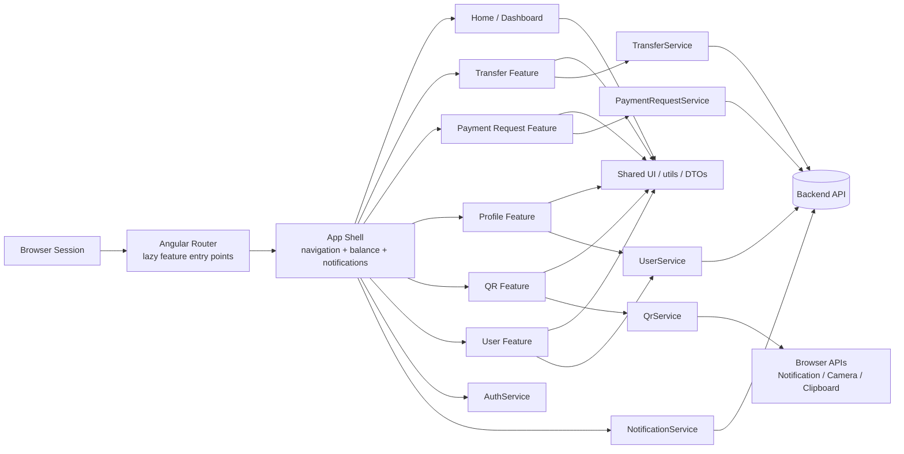
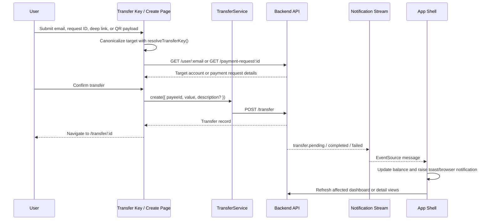

# Auronix Client

Portuguese (Brazil) version: [README.pt-BR.md](./README.pt-BR.md).

<a id="en-top"></a>

## Table of Contents

- [Project Overview](#en-project-overview)
- [System Architecture](#en-system-architecture)
- [Tech Stack](#en-tech-stack)
- [Domain & Core Concepts](#en-domain-core-concepts)
- [Implementation Details](#en-implementation-details)
- [Engineering Decisions & Trade-offs](#en-engineering-decisions--trade-offs)
- [Performance Considerations](#en-performance-considerations)
- [Security Considerations](#en-security-considerations)
- [Scalability & Reliability](#en-scalability--reliability)
- [Development Setup](#en-development-setup)
- [Running the Project](#en-running-the-project)
- [Testing Strategy](#en-testing-strategy)
- [Observability](#en-observability)
- [API Reference](#en-api-reference)
- [Roadmap / Future Improvements](#en-roadmap--future-improvements)
- [Português (Brasil)](./README.pt-BR.md)

<a id="en-project-overview"></a>

## Project Overview

Auronix Client is a browser-based financial workspace for authenticated account holders. It concentrates the client-side flows required to create an account, restore a protected session, inspect balance and recent activity, issue payment requests, authorize transfers, and interact with transfer entry points delivered as direct links or QR codes.

From an architectural standpoint, the application is a feature-sliced single-page application that behaves as a modular frontend monolith. Each route group owns a bounded slice of behavior, while shared concerns such as session state, notification streaming, DTO contracts, formatting utilities, and UI primitives remain centralized and reusable.

**Core value proposition**

- Unifies account access, transfer authorization, payment request issuance, and QR flows in a single client.
- Keeps the browser as a thin orchestration layer while the backend remains the source of truth for identity, balances, transfers, and payment requests.
- Prioritizes fast transactional feedback through server-sent events, signal-driven state, and explicit loading/error/empty states.

**Primary use cases**

- Authenticate or create an account and restore the session from a server-issued cookie.
- Review account balance and a recent transfer window from the dashboard or the paginated transfer ledger.
- Create payment requests, validate request details, and convert them into locked transfer authorizations.
- Accept transfer targets via email, request identifiers, deep links, or QR scans.
- Receive real-time balance and transfer status updates while navigating the protected workspace.

<a id="en-system-architecture"></a>

## System Architecture

The client is structured as a modular SPA with lazy-loaded route groups backed by resource-oriented services. The top-level shell owns navigation, session-aware presentation, and notification orchestration; feature pages remain thin and delegate transport and state persistence to services under `src/app/core/services`.

The architectural style is best described as a **feature-sliced SPA / modular frontend monolith**:

- **Single deployment unit**: one Angular application built and served as static assets.
- **Modular route boundaries**: `user`, `transfer`, `payment-request`, and `qr` are split through lazy feature routes.
- **Shared cross-cutting layer**: authentication, transport, formatting, reusable UI components, and DTO contracts live outside individual route groups.



| Component                 | Responsibility                                                                                            |
| ------------------------- | --------------------------------------------------------------------------------------------------------- |
| App shell                 | Protected navigation, balance display, notification routing, browser notification fallback                |
| Auth guard + auth service | Session restoration, in-memory authenticated user state, redirect-to-login flow                           |
| Resource services         | HTTP access to `/user`, `/transfer`, `/payment-request` and event consumption from `/notification/stream` |
| Feature pages             | Route-owned orchestration for dashboard, profile, transfer, payment request, QR display, and auth flows   |
| Shared layer              | UI components, skeleton states, input primitives, formatting, route key parsing, DTOs                     |

<details>
<summary>Architecture rationale</summary>

This structure favors low-friction delivery for a bounded client domain. A global state framework would add ceremony without clear benefit for the current scope, while a micro-frontend split would increase deployment and runtime complexity for flows that still share a tight transactional context, common navigation shell, and the same backend contracts.

</details>

<a id="en-tech-stack"></a>

## Tech Stack

| Layer                 | Technology                                                      | Role in the system                                                               | Why this choice fits the current architecture                                                                  |
| --------------------- | --------------------------------------------------------------- | -------------------------------------------------------------------------------- | -------------------------------------------------------------------------------------------------------------- |
| UI framework          | Angular 21 standalone APIs                                      | Application shell, routing, dependency injection, templates, `OnPush` components | Strong composition model for route-sliced UIs with built-in DI, hydration-ready primitives, and mature tooling |
| Language              | TypeScript 5.9 with strict mode                                 | Compile-time correctness and DTO discipline                                      | Helps keep API contracts explicit and catches template/service integration errors early                        |
| Local state and forms | Angular signals and `@angular/forms/signals`                    | Signal-backed view state, derived state, and form validation                     | Lower ceremony than store-heavy alternatives for a medium-sized SPA with mostly local interaction state        |
| Routing               | Angular Router with lazy `loadChildren`                         | Route segmentation by feature                                                    | Keeps transfer, QR, payment request, and auth code paths isolated and reduces initial bundle pressure          |
| Transport             | Angular `HttpClient` with `withFetch()` and request interceptor | Credentialed REST access                                                         | Centralizes cookie-aware HTTP behavior and uses the modern fetch-based backend                                 |
| Event streaming       | Native `EventSource`                                            | Server-sent transfer/balance notifications                                       | Efficient one-way push channel for status updates without WebSocket session management                         |
| QR generation         | `qrcode`                                                        | Generates downloadable/displayable QR payloads                                   | Fast path for rendering transfer entry QR codes                                                                |
| QR scanning fallback  | `jsqr` + `BarcodeDetector` when available                       | Camera-driven QR decoding                                                        | Progressive enhancement: browser-native detector first, canvas fallback second                                 |
| Styling               | SCSS                                                            | Global and component-scoped styling                                              | Sufficient for the current component model without introducing a CSS-in-JS runtime                             |
| Testing               | Vitest via Angular unit-test builder                            | Service, route, component, and utility tests                                     | Fast feedback loop and straightforward integration with Angular TestBed                                        |
| Accessibility testing | `axe-core` + `vitest-axe`                                       | Automated accessibility regression checks                                        | Provides structural accessibility assertions directly in component tests                                       |
| Package management    | Yarn 1.22                                                       | Dependency installation and scripts                                              | Matches the checked-in lockfile and existing scripts                                                           |

<a id="en-domain-core-concepts"></a>

## Domain & Core Concepts

| Concept            | Current representation                                     | Notes                                                                               |
| ------------------ | ---------------------------------------------------------- | ----------------------------------------------------------------------------------- |
| User               | `User` model                                               | Server-owned identity, email, display name, balance, and timestamps                 |
| Transfer           | `Transfer` model + `TransferStatus` enum                   | Movement between payer and payee with pending/completed/failed lifecycle            |
| Payment request    | `PaymentRequest` model                                     | Transfer precursor carrying an immutable requested amount and originating user      |
| Transfer key       | `resolveTransferKey()` result                              | Canonicalized entry mechanism that accepts email, request UUID, or first-party link |
| Cursor window      | `TransferCursor` inside `FindTransferDto` / `FindManyDto`  | Cursor-based navigation for transfer history                                        |
| Notification event | `NotificationStreamEvent` keyed by `NotificationEventType` | Real-time backend signal used to refresh balance and transfer views                 |

**Important invariants**

- Monetary values are handled as integer minor units (`number` in cents), not floating-point currency strings.
- A transfer target must resolve to exactly one canonical input: email or payment request identifier. Mixed or empty inputs are rejected.
- Absolute URLs are only accepted as transfer keys when they belong to the current origin; cross-origin deep links are treated as invalid.
- Payment-request-driven transfers lock the requested amount and beneficiary identity on the client to avoid manual tampering in the authorization step.
- Self-directed transfers are blocked in the UI for both direct email targeting and payment requests owned by the current user.
- Session state is ephemeral in the browser and derived from the backend via cookie-backed session decoding; credentials are not persisted in `localStorage` or `sessionStorage`.

```mermaid
flowchart TD
  Input[Raw transfer input]
  Parse[resolveTransferKey()]
  Url{Is first-party URL?}
  UrlType{URL type}
  Email{Valid email?}
  Request{Valid request UUID?}
  Invalid[Reject input]
  CanonicalEmail[Canonical email target]
  CanonicalRequest[Canonical payment request target]
  Authorization[Transfer authorization page]

  Input --> Parse
  Parse --> Url

  Url -->|Yes| UrlType
  Url -->|No| Email

  UrlType -->|Email URL| CanonicalEmail
  UrlType -->|Request URL| CanonicalRequest

  Email -->|Yes| CanonicalEmail
  Email -->|No| Request

  Request -->|Yes| CanonicalRequest
  Request -->|No| Invalid

  CanonicalEmail --> Authorization
  CanonicalRequest --> Authorization
```

<a id="en-implementation-details"></a>

## Implementation Details

### Folder structure

```text
src/
  app/
    core/
      enums/
      guards/
      models/
      services/
    features/
      home-page/
      payment-request/
      profile-page/
      qr/
      transfer/
      user/
    shared/
      components/
      dto/
      utils/
      view-models/
  main.ts
  styles.scss
public/
  favicon.ico
  icon.png
  icon.svg
angular.json
package.json
```

### Route surface

| Route                     | Access model | Purpose                                                     |
| ------------------------- | ------------ | ----------------------------------------------------------- |
| `/`                       | Guarded      | Dashboard with balance, metrics, and recent transfer window |
| `/profile`                | Guarded      | Profile management and logout                               |
| `/user/login`             | Public       | Credential-based session creation                           |
| `/user/create`            | Public       | Account creation                                            |
| `/transfer`               | Guarded      | Cursor-paginated transfer ledger                            |
| `/transfer/key`           | Guarded      | Manual or deep-link transfer target resolution              |
| `/transfer/scan`          | Guarded      | Camera-driven QR ingestion                                  |
| `/transfer/create`        | Guarded      | Transfer authorization and submission                       |
| `/transfer/:id`           | Guarded      | Transfer detail and timeline                                |
| `/payment-request/create` | Guarded      | Payment request issuance and sharing                        |
| `/payment-request/:id`    | Guarded      | Payment request validation/details                          |
| `/qr`                     | Guarded      | QR display for account or payment request payloads          |

### Important implementation patterns

| Pattern                          | Where it appears                                          | Why it matters                                                           |
| -------------------------------- | --------------------------------------------------------- | ------------------------------------------------------------------------ |
| Standalone components + `OnPush` | Across feature pages and shared components                | Keeps component registration local and change detection predictable      |
| Signal-backed view state         | Feature pages, `AuthService`, `ToastService` consumers    | Minimizes imperative synchronization between async results and templates |
| Resource-oriented services       | `UserService`, `TransferService`, `PaymentRequestService` | Keeps transport concerns isolated from route orchestration               |
| Lazy feature routing             | `app.routes.ts` and per-feature route files               | Reduces initial bundle scope and keeps features independently evolvable  |
| Explicit page states             | Skeleton, empty, success, info, danger variants           | Preserves UX clarity in asynchronous transactional flows                 |
| DTO-first transport typing       | `shared/dto/**` and `core/models/**`                      | Documents consumed backend contracts in code, not only in prose          |

### Data flow and request lifecycle

1. A public auth page or a guarded route is requested.
2. `AuthGuard` checks the in-memory session and, when necessary, calls `UserService.decodeToken()` to restore it from the backend.
3. The target page loads domain data through a resource service and exposes the result through signals.
4. The shell subscribes to `NotificationService.connect()` and updates balance or triggers targeted reloads when notification events arrive.
5. Shared formatters and UI primitives render a stable transactional interface with explicit empty/loading/error states.



<a id="en-engineering-decisions--trade-offs"></a>

## Engineering Decisions & Trade-offs

| Decision                                    | Benefit                                                                        | Cost / trade-off                                                                                 |
| ------------------------------------------- | ------------------------------------------------------------------------------ | ------------------------------------------------------------------------------------------------ |
| Signals instead of a global state framework | Lower ceremony, local reasoning, small API surface                             | Cross-feature coordination remains manual and event-driven rather than centrally modeled         |
| Thin feature pages plus transport services  | Easy-to-trace request ownership and test seams                                 | Repeated subscription/error-handling patterns can emerge without higher-level query abstractions |
| Cookie-backed auth with server decoding     | Avoids token storage in the browser and keeps session authority on the backend | Requires coordinated server cookie, CORS, and deployment configuration                           |
| SSE for notifications                       | Efficient one-way real-time updates for transfer status                        | Less flexible than duplex channels and currently lacks explicit client-side reconnect strategy   |
| Cursor pagination for transfers             | Stable pagination under concurrent writes and large histories                  | More complex than offset pagination for debugging and manual API inspection                      |
| Compile-time `API_URL` define               | Simple, explicit environment coupling during builds                            | Less deployment-flexible than runtime configuration injection                                    |
| `BarcodeDetector` plus `jsqr` fallback      | Best-effort camera support across browsers                                     | Adds CommonJS optimization warnings and some runtime decoding overhead                           |

<details>
<summary>Alternatives and why they are not the current shape</summary>

- **NgRx or a larger client store**: justified for broader cross-page workflows, optimistic updates, or offline queues, but currently heavier than the application’s state surface.
- **Offset pagination**: simpler to reason about, but weaker under active ledgers where new transfers can shift the window between requests.
- **WebSockets**: better for bidirectional workflows, but unnecessary for the current one-way notification stream.
- **Runtime environment files**: more deployment-friendly, but not present in the current build system, which uses Angular CLI `define` constants instead.
- **Pure browser-native QR scanning**: not portable enough because `BarcodeDetector` availability still varies by browser.

</details>

<a id="en-performance-considerations"></a>

## Performance Considerations

The target posture is a low-latency SPA where the browser only keeps the minimum state required for interaction while authoritative financial state remains server-side. The current implementation already aligns with that direction in several important ways.

| Concern                     | Current posture                                                          | Operational implication                                                                  |
| --------------------------- | ------------------------------------------------------------------------ | ---------------------------------------------------------------------------------------- |
| Initial load size           | Feature routes are lazy-loaded                                           | Transfer, QR, payment request, and auth code paths do not all land in the initial bundle |
| View updates                | Signals + `OnPush` change detection                                      | Updates stay scoped to affected signals rather than broad template invalidation          |
| Transfer history navigation | Cursor-based API contract                                                | Better stability for large or active ledgers than offset-based paging                    |
| Real-time freshness         | SSE-driven refreshes instead of polling                                  | Reduces request churn while keeping balance/status views responsive                      |
| Caching                     | Intentionally shallow and in-memory                                      | Keeps stale financial state risk low, but increases repeat fetches across sessions       |
| Camera scanning             | Browser detector first, `jsqr` fallback second                           | Preserves compatibility at the cost of additional CPU work in fallback mode              |
| Build optimization          | Production build succeeds with CommonJS warnings for `qrcode` and `jsqr` | Bundle optimization can be improved further by migrating to ESM-capable QR libraries     |

**Backend-facing performance expectations**

- `/transfer` should be indexed for cursor scans on `(completedAt, id)` or an equivalent stable ordering key.
- `/transfer/:id`, `/payment-request/:id`, and `/user/:email` should be backed by direct lookups.
- Notification fan-out should be efficient enough that the client does not fall back to active polling.

<a id="en-security-considerations"></a>

## Security Considerations

Production deployment should treat the client as an untrusted edge participant and keep authorization decisions on the backend. The current frontend already follows a number of security-positive patterns, but some controls remain deployment- or server-dependent by design.

| Area                    | Current client behavior                                                                              | Expected production posture                                                                           |
| ----------------------- | ---------------------------------------------------------------------------------------------------- | ----------------------------------------------------------------------------------------------------- |
| Authentication          | REST calls are forced to `withCredentials`; session restoration happens through `GET /user` decoding | Backend should enforce secure, `HttpOnly`, and correctly scoped cookies                               |
| Session persistence     | No token storage in `localStorage` / `sessionStorage`                                                | Preserve server-owned session authority and avoid client-side secret storage                          |
| Authorization           | Guarded routes require an active or restorable session                                               | Backend remains the source of truth for all access checks                                             |
| Input validation        | Email, payment request IDs, amounts, and transfer keys are validated before submission               | Backend must revalidate all client-submitted data                                                     |
| QR/deep-link safety     | Cross-origin absolute URLs are rejected during transfer key resolution                               | Limits accidental trust in external transfer payloads                                                 |
| Notification permission | Browser notification permission is requested only when needed                                        | Minimizes unnecessary permission prompts                                                              |
| SSE channel             | Consumed via native `EventSource`                                                                    | Simplest and safest when frontend and backend are deployed under a compatible origin/session strategy |

**Security notes**

- Because the client uses a compile-time `API_URL`, deployment topology matters. Same-origin or carefully configured cross-origin cookie behavior is required.
- CSRF protection, cookie flags, CORS rules, rate limiting, and fraud controls are backend concerns and are not implemented in this repository.
- The client prevents obvious self-payment scenarios, but final transactional enforcement must remain server-side.

<a id="en-scalability--reliability"></a>

## Scalability & Reliability

The frontend build itself is stateless and scales horizontally as static assets. Reliability therefore depends less on client replication and more on predictable backend contracts, bounded browser state, and graceful degradation when optional capabilities are unavailable.

| Aspect                | Current behavior                                                                | Reliability impact                                                        |
| --------------------- | ------------------------------------------------------------------------------- | ------------------------------------------------------------------------- |
| Static deployment     | Angular build emits static browser assets under `dist/auronix/browser/`         | Easy CDN or edge distribution                                             |
| Session bootstrap     | Guard can restore session on navigation                                         | Reduces hard failures after refresh or direct deep links                  |
| Notification handling | Shell updates balance and falls back from browser notifications to in-app toast | Preserves user feedback even when platform APIs are unavailable           |
| Camera capture        | Uses browser-native detector when available and fallback QR decoding otherwise  | Maintains functionality across a broader browser/device matrix            |
| Request race control  | Transfer creation flow ignores stale target responses after route changes       | Prevents out-of-order async results from corrupting the active form state |
| Failure states        | Dedicated error, empty, info, and skeleton states across major pages            | Degrades predictably under latency or backend errors                      |


<a id="en-development-setup"></a>

## Development Setup

### Prerequisites

| Tool        | Verified version | Notes                                             |
| ----------- | ---------------- | ------------------------------------------------- |
| Node.js     | `24.11.1`        | Local verification was executed with this version |
| Yarn        | `1.22.22`        | Matches `packageManager` and lockfile             |
| Angular CLI | `21.2.5`         | Installed locally through project dependencies    |

### Local setup

1. Install dependencies.
2. Ensure a compatible backend is running at the configured API origin.
3. Start the Angular development server.
4. Authenticate through `/user/login` or create a new account through `/user/create`.

```bash
yarn install
yarn start
```

### Environment and configuration

There is no checked-in `.env` workflow in this repository. The API origin is injected at build time through Angular CLI `define` constants in [`angular.json`](./angular.json).

| Configuration | Source                 | Current value           | Scope                                                                                        |
| ------------- | ---------------------- | ----------------------- | -------------------------------------------------------------------------------------------- |
| `API_URL`     | Angular build `define` | `http://localhost:3000` | Used by `UserService`, `TransferService`, `PaymentRequestService`, and `NotificationService` |

If a different backend origin is required, update the `define.API_URL` entries in both the `development` and `production` build configurations:

```json
"define": {
  "API_URL": "'https://api.example.com'"
}
```

## Running the Project

| Goal                                | Command                   | Result                                                    |
| ----------------------------------- | ------------------------- | --------------------------------------------------------- |
| Start a local dev server            | `yarn start`              | Runs `ng serve` using the development build configuration |
| Continuous build during development | `yarn watch`              | Runs `ng build --watch --configuration development`       |
| Produce a production build          | `yarn build`              | Emits static artifacts under `dist/auronix/browser/`      |
| Run the test suite                  | `yarn test --watch=false` | Executes the checked-in Vitest suite in non-watch mode    |

For production deployment, this repository currently provides the frontend build only. The expected workflow is:

```bash
yarn install
yarn build
```

Then publish `dist/auronix/browser/` to the static hosting platform of choice and make sure the deployed frontend can reach a compatible backend/API origin.

<a id="en-testing-strategy"></a>

## Testing Strategy

The repository currently emphasizes fast feedback through unit and component-level tests rather than browser-driven end-to-end automation.

| Test layer          | Current coverage                                                    | Tooling                   |
| ------------------- | ------------------------------------------------------------------- | ------------------------- |
| Route configuration | Guarding and lazy route registration                                | Angular TestBed + Vitest  |
| Services            | Resource transport contracts, auth state, QR utilities, SSE parsing | Angular TestBed + Vitest  |
| Feature pages       | Form validation, async states, navigation, error handling           | Angular TestBed + Vitest  |
| Shared components   | Rendering logic and UI contract behavior                            | Angular TestBed + Vitest  |
| Accessibility       | Representative page/component axe assertions                        | `axe-core` + `vitest-axe` |

**Verified local result**

- `45` test files passed.
- `149` individual tests passed.
- `yarn build` passed locally.

<a id="en-observability"></a>

## Observability

The intended observability model for this client is operationally lightweight: surface domain state clearly to the user, make asynchronous failures explicit during development, and leave authoritative telemetry aggregation to platform-level tooling once it exists.

| Layer         | Current signal                                                                     | What it provides                                                              |
| ------------- | ---------------------------------------------------------------------------------- | ----------------------------------------------------------------------------- |
| Build-time    | Strict TypeScript, Angular budgets, local build verification                       | Early detection of type drift and oversized bundles                           |
| Test-time     | Vitest + accessibility assertions                                                  | Regression detection for behavior, route contracts, and UI semantics          |
| Runtime UX    | Skeletons, empty states, inline errors, toast notifications, browser notifications | User-visible feedback for loading, failure, and background status transitions |
| Domain events | SSE notification stream                                                            | Real-time transfer lifecycle and balance updates                              |

<a id="en-api-reference"></a>

## API Reference

The frontend consumes a small, resource-oriented backend surface. The tables and examples below document the client contract, not the full backend implementation.

### Resource summary

| Endpoint               | Method      | Used for                          | Client notes                       |
| ---------------------- | ----------- | --------------------------------- | ---------------------------------- |
| `/user`                | `POST`      | Account creation                  | Public                             |
| `/user/login`          | `POST`      | Session creation                  | Public                             |
| `/user/logout`         | `POST`      | Session termination               | Public                       |
| `/user`                | `GET`       | Session decode / current user     | Credentialed; used by `AuthGuard`  |
| `/user/:email`         | `GET`       | Transfer target lookup            | Credentialed; email is URL-encoded |
| `/user`                | `PATCH`     | Profile update                    | Credentialed                       |
| `/user`                | `DELETE`    | Account deletion                  | Credentialed                       |
| `/transfer`            | `POST`      | Transfer creation                 | Credentialed                       |
| `/transfer`            | `GET`       | Cursor-paginated transfer listing | Credentialed                       |
| `/transfer/:id`        | `GET`       | Transfer detail                   | Credentialed                       |
| `/payment-request`     | `POST`      | Payment request creation          | Credentialed                       |
| `/payment-request/:id` | `GET`       | Payment request lookup            | Credentialed                       |
| `/notification/stream` | `GET` (SSE) | Transfer/balance event stream     | Consumed with native `EventSource` |

### Core DTOs and models

| Type                      | Shape                                                                                                 |
| ------------------------- | ----------------------------------------------------------------------------------------------------- |
| `CreateUserDto`           | `{ email: string; name: string; password: string }`                                                   |
| `LoginUserDto`            | `{ email: string; password: string }`                                                                 |
| `UpdateUserDto`           | `Partial<CreateUserDto>`                                                                              |
| `CreateTransferDto`       | `{ payeeId: string; value: number; description?: string }`                                            |
| `FindTransferDto`         | `{ limit: number; cursor?: TransferCursor \| null }`                                                  |
| `TransferCursor`          | `{ completedAt: string; id: string }`                                                                 |
| `FindManyDto<T, TCursor>` | `{ data: T[]; next: TCursor \| null }`                                                                |
| `CreatePaymentRequestDto` | `{ value: number }`                                                                                   |
| `User`                    | `{ id; email; name; balance; createdAt; updatedAt }`                                                  |
| `Transfer`                | `{ id; value; description?; status; failureReason; completedAt; payer; payee; createdAt; updatedAt }` |
| `PaymentRequest`          | `{ id; value; user?; createdAt }`                                                                     |

### Example requests and responses

```http
POST /user/login
Content-Type: application/json

{
  "email": "joao@auronix.com",
  "password": "StrongP@ss1"
}
```

```json
{
  "id": "user-id",
  "email": "joao@auronix.com",
  "name": "Joao",
  "balance": 100000,
  "createdAt": "2026-03-29T00:00:00.000Z",
  "updatedAt": "2026-03-29T00:00:00.000Z"
}
```

```http
POST /transfer
Content-Type: application/json

{
  "payeeId": "payee-id",
  "value": 19990,
  "description": "Primary settlement"
}
```

```json
{
  "id": "transfer-id",
  "value": 19990,
  "description": "Primary settlement",
  "status": "pending",
  "failureReason": null,
  "completedAt": null,
  "payer": {
    "id": "payer-id",
    "email": "joao@auronix.com",
    "name": "Joao",
    "balance": 80010,
    "createdAt": "2026-03-29T00:00:00.000Z",
    "updatedAt": "2026-03-29T00:00:00.000Z"
  },
  "payee": {
    "id": "payee-id",
    "email": "maria@auronix.com",
    "name": "Maria",
    "balance": 120000,
    "createdAt": "2026-03-29T00:00:00.000Z",
    "updatedAt": "2026-03-29T00:00:00.000Z"
  },
  "createdAt": "2026-03-29T10:00:00.000Z",
  "updatedAt": "2026-03-29T10:00:00.000Z"
}
```

```http
GET /transfer?limit=8&cursor=%7B%22completedAt%22%3A%222026-03-29T10%3A00%3A00.000Z%22%2C%22id%22%3A%22transfer-id%22%7D
```

```json
{
  "data": [
    {
      "id": "transfer-id",
      "value": 19990,
      "description": "Primary settlement",
      "status": "completed",
      "failureReason": null,
      "completedAt": "2026-03-29T10:05:00.000Z",
      "payer": {
        "id": "payer-id",
        "email": "joao@auronix.com",
        "name": "Joao",
        "balance": 80010,
        "createdAt": "2026-03-29T00:00:00.000Z",
        "updatedAt": "2026-03-29T00:00:00.000Z"
      },
      "payee": {
        "id": "payee-id",
        "email": "maria@auronix.com",
        "name": "Maria",
        "balance": 139990,
        "createdAt": "2026-03-29T00:00:00.000Z",
        "updatedAt": "2026-03-29T00:00:00.000Z"
      },
      "createdAt": "2026-03-29T10:00:00.000Z",
      "updatedAt": "2026-03-29T10:05:00.000Z"
    }
  ],
  "next": {
    "completedAt": "2026-03-28T12:00:00.000Z",
    "id": "older-transfer-id"
  }
}
```

```http
POST /payment-request
Content-Type: application/json

{
  "value": 3500
}
```

```json
{
  "id": "550e8400-e29b-41d4-a716-446655440000",
  "value": 3500,
  "user": {
    "id": "payee-id",
    "name": "Maria"
  },
  "createdAt": "2026-03-29T10:00:00.000Z"
}
```

### Notification stream contract

The client subscribes to these named SSE events:

- `transfer.pending`
- `transfer.completed`
- `transfer.failed`

```text
event: transfer.completed
id: 42
data: {"type":"transfer.completed","data":{"transferId":"transfer-id","amount":5000,"createdAt":"2026-03-29T00:00:00.000Z","description":"Primary settlement","balance":95000}}
```

<details>
<summary>Extended event payload shapes</summary>

```ts
type TransferPendingNotificationData = {
  transferId: string;
  amount: number;
  createdAt: string;
  description: string | null;
  balance: number;
  payer?: { id: string; email: string; name: string } | null;
};

type TransferCompletedNotificationData = {
  transferId: string;
  amount: number;
  createdAt: string;
  description: string | null;
  balance: number;
};

type TransferFailedNotificationData = {
  transferId: string;
  amount: number;
  createdAt: string;
  description: string | null;
  balance: number;
  failureReason: string;
};
```

</details>
