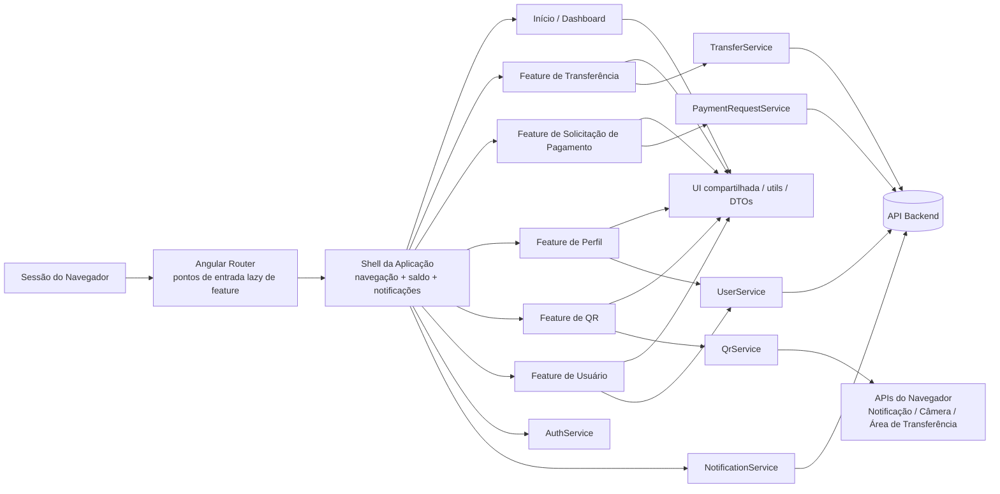
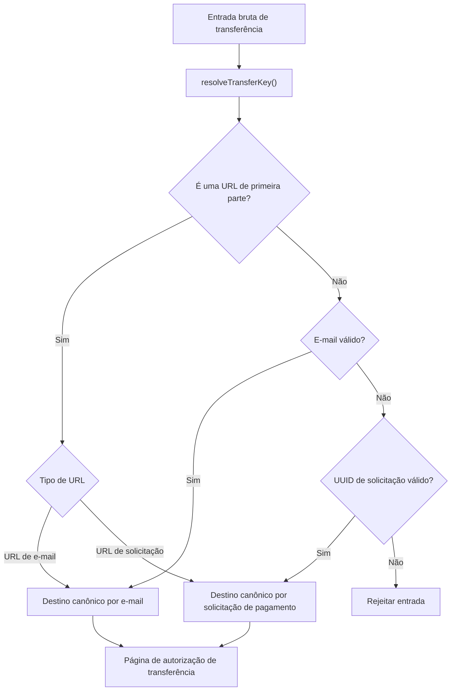
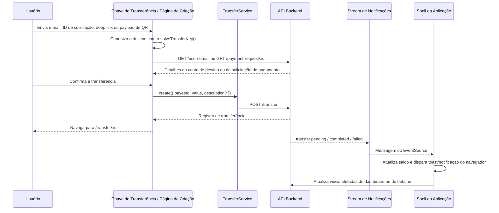

# Auronix Client

Versão em inglês: [README.md](./README.md).

<a id="pt-top"></a>
## Sumário

- [Visão Geral do Projeto](#pt-visao-geral-do-projeto)
- [Arquitetura do Sistema](#pt-arquitetura-do-sistema)
- [Stack Tecnológica](#pt-stack-tecnologica)
- [Domínio e Conceitos Centrais](#pt-dominio-e-conceitos-centrais)
- [Detalhes de Implementação](#pt-detalhes-de-implementacao)
- [Decisões de Engenharia e Trade-offs](#pt-decisoes-de-engenharia--trade-offs)
- [Considerações de Performance](#pt-consideracoes-de-performance)
- [Considerações de Segurança](#pt-consideracoes-de-seguranca)
- [Escalabilidade e Confiabilidade](#pt-escalabilidade--confiabilidade)
- [Configuração de Desenvolvimento](#pt-configuracao-de-desenvolvimento)
- [Execução do Projeto](#pt-execucao-do-projeto)
- [Estratégia de Testes](#pt-estrategia-de-testes)
- [Observabilidade](#pt-observabilidade)
- [Referência de API](#pt-referencia-de-api)
- [Roadmap / Melhorias Futuras](#pt-roadmap--melhorias-futuras)
- [Versão em Inglês](./README.md)

<a id="pt-visao-geral-do-projeto"></a>
## Visão Geral do Projeto

O Auronix Client é um workspace financeiro baseado em navegador para titulares de conta autenticados. Ele concentra os fluxos do lado do cliente necessários para criar uma conta, restaurar uma sessão protegida, inspecionar saldo e atividade recente, emitir solicitações de pagamento, autorizar transferências e interagir com pontos de entrada de transferência entregues como links diretos ou QR codes.

Do ponto de vista arquitetural, a aplicação é uma aplicação de página única fatiada por feature que se comporta como um monólito frontend modular. Cada grupo de rotas possui uma fatia delimitada de comportamento, enquanto preocupações compartilhadas como estado de sessão, streaming de notificações, contratos DTO, utilitários de formatação e primitivas de UI permanecem centralizadas e reutilizáveis.

**Proposta central de valor**

- Unifica acesso à conta, autorização de transferência, emissão de solicitações de pagamento e fluxos com QR em um único cliente.
- Mantém o navegador como uma camada fina de orquestração enquanto o backend continua sendo a fonte da verdade para identidade, saldos, transferências e solicitações de pagamento.
- Prioriza feedback transacional rápido por meio de server-sent events, estado orientado por signals e estados explícitos de carregamento/erro/vazio.

**Casos de uso principais**

- Autenticar ou criar uma conta e restaurar a sessão a partir de um cookie emitido pelo servidor.
- Revisar o saldo da conta e uma janela recente de transferências a partir do dashboard ou do extrato paginado de transferências.
- Criar solicitações de pagamento, validar os detalhes da solicitação e convertê-las em autorizações de transferência bloqueadas.
- Aceitar destinos de transferência via e-mail, identificadores de solicitação, deep links ou leituras de QR.
- Receber atualizações em tempo real de saldo e status de transferência enquanto navega no workspace protegido.

<a id="pt-arquitetura-do-sistema"></a>
## Arquitetura do Sistema

O cliente é estruturado como uma SPA modular com grupos de rotas lazy-loaded apoiados por serviços orientados a recursos. O shell de nível superior é responsável pela navegação, pela apresentação sensível à sessão e pela orquestração de notificações; as páginas de feature permanecem enxutas e delegam transporte e persistência de estado aos serviços em `src/app/core/services`.

O estilo arquitetural é melhor descrito como uma **SPA fatiada por feature / monólito frontend modular**:

- **Unidade única de deployment**: uma aplicação Angular construída e servida como assets estáticos.
- **Limites modulares de rotas**: `user`, `transfer`, `payment-request` e `qr` são separados por meio de rotas lazy de feature.
- **Camada transversal compartilhada**: autenticação, transporte, formatação, componentes de UI reutilizáveis e contratos DTO vivem fora de grupos de rota individuais.



| Componente | Responsabilidade |
| --- | --- |
| Shell da aplicação | Navegação protegida, exibição de saldo, roteamento de notificações, fallback para notificações do navegador |
| Guard de auth + serviço de auth | Restauração de sessão, estado do usuário autenticado em memória, fluxo de redirecionamento para login |
| Serviços de recursos | Acesso HTTP a `/user`, `/transfer`, `/payment-request` e consumo de eventos de `/notification/stream` |
| Páginas de feature | Orquestração por rota para dashboard, perfil, transferência, solicitação de pagamento, exibição de QR e fluxos de auth |
| Camada compartilhada | Componentes de UI, estados skeleton, primitivas de entrada, formatação, parsing de chave de rota, DTOs |

<details>
<summary>Justificativa da arquitetura</summary>

Essa estrutura favorece uma entrega de baixo atrito para um domínio de cliente delimitado. Um framework global de estado adicionaria cerimônia sem benefício claro para o escopo atual, enquanto uma divisão em micro-frontends aumentaria a complexidade de deployment e runtime para fluxos que ainda compartilham um contexto transacional apertado, um shell de navegação comum e os mesmos contratos de backend.

</details>

<a id="pt-stack-tecnologica"></a>
## Stack Tecnológica

| Camada | Tecnologia | Papel no sistema | Por que essa escolha se encaixa na arquitetura atual |
| --- | --- | --- | --- |
| Framework de UI | Angular 21 com APIs standalone | Shell da aplicação, rotas, injeção de dependência, templates, componentes `OnPush` | Modelo forte de composição para UIs fatiadas por rota com DI embutida, primitivas prontas para hidratação e tooling maduro |
| Linguagem | TypeScript 5.9 em modo estrito | Correção em tempo de compilação e disciplina de DTOs | Ajuda a manter contratos de API explícitos e captura cedo erros entre template e serviços |
| Estado local e formulários | Angular signals e `@angular/forms/signals` | Estado de view sustentado por signals, estado derivado e validação de formulário | Menos cerimônia do que alternativas pesadas baseadas em store para uma SPA de porte médio com estado de interação majoritariamente local |
| Roteamento | Angular Router com `loadChildren` lazy | Segmentação de rotas por feature | Mantém os caminhos de transferência, QR, solicitação de pagamento e auth isolados e reduz a pressão sobre o bundle inicial |
| Transporte | Angular `HttpClient` com `withFetch()` e interceptor de requisição | Acesso REST com credenciais | Centraliza o comportamento HTTP sensível a cookies e usa o backend moderno baseado em fetch |
| Streaming de eventos | `EventSource` nativo | Notificações de transferência/saldo via server-sent events | Canal push unidirecional eficiente para atualizações de status sem gerenciamento de sessão WebSocket |
| Geração de QR | `qrcode` | Gera payloads de QR exibíveis e baixáveis | Caminho rápido para renderizar QR codes de entrada de transferência |
| Fallback de leitura de QR | `jsqr` + `BarcodeDetector` quando disponível | Decodificação de QR orientada por câmera | Aprimoramento progressivo: detector nativo do navegador primeiro, fallback via canvas em segundo |
| Estilização | SCSS | Estilização global e com escopo por componente | Suficiente para o modelo de componentes atual sem introduzir um runtime de CSS-in-JS |
| Testes | Vitest via builder de testes unitários do Angular | Testes de serviços, rotas, componentes e utilitários | Loop de feedback rápido e integração direta com Angular TestBed |
| Testes de acessibilidade | `axe-core` + `vitest-axe` | Verificações automatizadas de regressão de acessibilidade | Fornece asserções estruturais de acessibilidade diretamente em testes de componente |
| Gerenciamento de pacotes | Yarn 1.22 | Instalação de dependências e scripts | Alinha com o lockfile versionado e os scripts existentes |

<a id="pt-dominio-e-conceitos-centrais"></a>
## Domínio e Conceitos Centrais

| Conceito | Representação atual | Observações |
| --- | --- | --- |
| Usuário | modelo `User` | Identidade controlada pelo servidor, e-mail, nome de exibição, saldo e timestamps |
| Transferência | modelo `Transfer` + enum `TransferStatus` | Movimentação entre pagador e recebedor com ciclo de vida pending/completed/failed |
| Solicitação de pagamento | modelo `PaymentRequest` | Precursor da transferência que carrega um valor solicitado imutável e o usuário de origem |
| Chave de transferência | resultado de `resolveTransferKey()` | Mecanismo de entrada canonizado que aceita e-mail, UUID de solicitação ou link de primeira parte |
| Janela por cursor | `TransferCursor` dentro de `FindTransferDto` / `FindManyDto` | Navegação baseada em cursor para o histórico de transferências |
| Evento de notificação | `NotificationStreamEvent` indexado por `NotificationEventType` | Sinal do backend em tempo real usado para atualizar saldo e views de transferência |

**Invariantes importantes**

- Valores monetários são tratados como unidades inteiras menores (`number` em centavos), não como strings monetárias em ponto flutuante.
- Um destino de transferência deve resolver para exatamente uma entrada canônica: e-mail ou identificador de solicitação de pagamento. Entradas mistas ou vazias são rejeitadas.
- URLs absolutas só são aceitas como chaves de transferência quando pertencem à origem atual; deep links cross-origin são tratados como inválidos.
- Transferências guiadas por solicitação de pagamento bloqueiam o valor solicitado e a identidade do beneficiário no cliente para evitar adulteração manual na etapa de autorização.
- Transferências para a própria conta são bloqueadas na UI tanto para direcionamento direto por e-mail quanto para solicitações de pagamento pertencentes ao usuário atual.
- O estado de sessão é efêmero no navegador e derivado do backend por meio de decodificação de sessão baseada em cookie; credenciais não são persistidas em `localStorage` nem `sessionStorage`.



<a id="pt-detalhes-de-implementacao"></a>
## Detalhes de Implementação

### Estrutura de pastas

```text
src/
  app/
    core/
      enums/
      guards/
      models/
      services/
    features/
      home-page/
      payment-request/
      profile-page/
      qr/
      transfer/
      user/
    shared/
      components/
      dto/
      utils/
      view-models/
  main.ts
  styles.scss
public/
  favicon.ico
  icon.png
  icon.svg
angular.json
package.json
```

### Superfície de rotas

| Rota | Modelo de acesso | Finalidade |
| --- | --- | --- |
| `/` | Protegida | Dashboard com saldo, métricas e janela recente de transferências |
| `/profile` | Protegida | Gerenciamento de perfil e logout |
| `/user/login` | Pública | Criação de sessão por credenciais |
| `/user/create` | Pública | Criação de conta |
| `/transfer` | Protegida | Extrato de transferências paginado por cursor |
| `/transfer/key` | Protegida | Resolução manual ou por deep link do destino da transferência |
| `/transfer/scan` | Protegida | Ingestão de QR orientada por câmera |
| `/transfer/create` | Protegida | Autorização e envio da transferência |
| `/transfer/:id` | Protegida | Detalhe e linha do tempo da transferência |
| `/payment-request/create` | Protegida | Emissão e compartilhamento de solicitação de pagamento |
| `/payment-request/:id` | Protegida | Validação/detalhes da solicitação de pagamento |
| `/qr` | Protegida | Exibição de QR para payloads de conta ou solicitação de pagamento |

### Padrões importantes de implementação

| Padrão | Onde aparece | Por que importa |
| --- | --- | --- |
| Componentes standalone + `OnPush` | Em páginas de feature e componentes compartilhados | Mantém o registro de componentes local e a detecção de mudanças previsível |
| Estado de view sustentado por signals | Páginas de feature, `AuthService`, consumidores de `ToastService` | Minimiza a sincronização imperativa entre resultados assíncronos e templates |
| Serviços orientados a recursos | `UserService`, `TransferService`, `PaymentRequestService` | Mantém as preocupações de transporte isoladas da orquestração por rota |
| Roteamento lazy por feature | `app.routes.ts` e arquivos de rota por feature | Reduz o escopo do bundle inicial e mantém as features evoluíveis de forma independente |
| Estados explícitos de página | Variantes skeleton, empty, success, info e danger | Preserva a clareza da UX em fluxos transacionais assíncronos |
| Tipagem de transporte guiada por DTO | `shared/dto/**` e `core/models/**` | Documenta em código os contratos de backend consumidos, não apenas em prosa |

### Fluxo de dados e ciclo de vida da requisição

1. Uma página pública de autenticação ou uma rota protegida é requisitada.
2. `AuthGuard` verifica a sessão em memória e, quando necessário, chama `UserService.decodeToken()` para restaurá-la a partir do backend.
3. A página de destino carrega dados de domínio por meio de um serviço orientado a recursos e expõe o resultado por meio de signals.
4. O shell assina `NotificationService.connect()` e atualiza o saldo ou dispara recarregamentos direcionados quando eventos de notificação chegam.
5. Formatadores compartilhados e primitivas de UI renderizam uma interface transacional estável com estados explícitos de vazio/carregamento/erro.



<a id="pt-decisoes-de-engenharia--trade-offs"></a>
## Decisões de Engenharia e Trade-offs

| Decisão | Benefício | Custo / trade-off |
| --- | --- | --- |
| Signals em vez de um framework global de estado | Menos cerimônia, raciocínio local, superfície de API menor | Coordenação entre features continua manual e orientada a eventos, não centralmente modelada |
| Páginas de feature enxutas mais serviços de transporte | Responsabilidade pelas requisições fácil de rastrear e bons pontos de teste | Padrões repetidos de inscrição/tratamento de erro podem surgir sem abstrações de query de nível mais alto |
| Autenticação por cookie com decodificação no servidor | Evita armazenamento de token no navegador e mantém autoridade de sessão no backend | Exige configuração coordenada de cookies, CORS e deployment no servidor |
| SSE para notificações | Atualizações em tempo real eficientes e unidirecionais | Menos flexível que canais full-duplex e atualmente sem estratégia explícita de reconnect no cliente |
| Paginação por cursor para transferências | Paginação estável sob escritas concorrentes e históricos grandes | Mais complexa que offset pagination para debugging e inspeção manual de API |
| Definição de `API_URL` em tempo de build | Acoplamento simples e explícito ao ambiente durante os builds | Menos flexível para deployment do que injeção de configuração em tempo de execução |
| `BarcodeDetector` mais fallback com `jsqr` | Melhor esforço de suporte por câmera entre navegadores | Adiciona avisos de otimização CommonJS e algum overhead de decodificação em tempo de execução |

<details>
<summary>Alternativas e por que elas não são a forma atual</summary>

- **NgRx ou uma store de cliente maior**: justificável para fluxos mais amplos entre páginas, atualizações otimistas ou filas offline, mas atualmente é mais pesada do que a superfície de estado da aplicação.
- **Paginação por offset**: mais simples de raciocinar, mas mais fraca em extratos ativos, em que novas transferências podem deslocar a janela entre requisições.
- **WebSockets**: melhores para fluxos bidirecionais, mas desnecessários para o stream de notificações unidirecional atual.
- **Arquivos de ambiente em runtime**: mais amigáveis para deployment, mas não estão presentes no sistema de build atual, que usa constantes `define` do Angular CLI.
- **Leitura de QR puramente nativa do navegador**: ainda não é portável o suficiente porque a disponibilidade de `BarcodeDetector` varia.

</details>

<a id="pt-consideracoes-de-performance"></a>
## Considerações de Performance

A postura-alvo é uma SPA de baixa latência em que o navegador mantém apenas o estado mínimo necessário para a interação, enquanto o estado financeiro autoritativo permanece no lado do servidor. A implementação atual já se alinha a essa direção de várias maneiras importantes.

| Preocupação | Postura atual | Implicação operacional |
| --- | --- | --- |
| Tamanho da carga inicial | Rotas de feature são lazy-loaded | Os caminhos de transferência, QR, solicitação de pagamento e auth não chegam todos ao bundle inicial |
| Atualizações de view | Signals + detecção de mudanças `OnPush` | As atualizações permanecem restritas aos signals afetados em vez de invalidar amplamente os templates |
| Navegação no histórico de transferências | Contrato de API baseado em cursor | Melhor estabilidade para extratos grandes ou ativos do que paginação baseada em offset |
| Atualização em tempo real | Refreshes orientados por SSE em vez de polling | Reduz o churn de requisições ao mesmo tempo em que mantém as views de saldo/status responsivas |
| Cache | Intencionalmente raso e em memória | Mantém baixo o risco de estado financeiro obsoleto, mas aumenta buscas repetidas entre sessões |
| Leitura por câmera | Detector do navegador primeiro, fallback com `jsqr` em segundo | Preserva a compatibilidade ao custo de trabalho adicional de CPU no modo de fallback |
| Otimização de build | O build de produção passa com avisos CommonJS para `qrcode` e `jsqr` | A otimização do bundle ainda pode melhorar com a migração para bibliotecas de QR compatíveis com ESM |

**Expectativas de performance voltadas ao backend**

- `/transfer` deve ser indexado para leituras por cursor em `(completedAt, id)` ou em uma chave de ordenação estável equivalente.
- `/transfer/:id`, `/payment-request/:id` e `/user/:email` devem ser sustentados por buscas diretas.
- O fan-out de notificações deve ser eficiente o suficiente para que o cliente não recaia em polling ativo.

<a id="pt-consideracoes-de-seguranca"></a>
## Considerações de Segurança

O deployment em produção deve tratar o cliente como um participante de borda não confiável e manter as decisões de autorização no backend. O frontend atual já segue vários padrões positivos do ponto de vista de segurança, mas alguns controles permanecem dependentes do deployment ou do servidor por desenho.

| Área | Comportamento atual do cliente | Postura esperada em produção |
| --- | --- | --- |
| Autenticação | Chamadas REST são forçadas a `withCredentials`; a restauração de sessão acontece por meio da decodificação de `GET /user` | O backend deve aplicar cookies seguros, `HttpOnly` e corretamente delimitados |
| Persistência de sessão | Nenhum token é armazenado em `localStorage` / `sessionStorage` | Preservar a autoridade da sessão no servidor e evitar armazenamento de segredo no lado do cliente |
| Autorização | Rotas protegidas exigem uma sessão ativa ou restaurável | O backend permanece como a fonte da verdade para todas as verificações de acesso |
| Validação de entrada | E-mail, IDs de solicitação de pagamento, valores e chaves de transferência são validados antes do envio | O backend deve revalidar todos os dados enviados pelo cliente |
| Segurança de QR/deep link | URLs absolutas cross-origin são rejeitadas durante a resolução da chave | Limita confiança acidental em payloads externos de transferência |
| Permissão de notificação | A permissão do navegador é solicitada apenas quando necessário | Minimiza prompts de permissão desnecessários |
| Canal SSE | Consumido via `EventSource` nativo | Mais simples e mais seguro quando frontend e backend são implantados sob uma estratégia compatível de origem/sessão |

**Notas de segurança**

- Como o cliente usa uma `API_URL` definida em tempo de compilação, a topologia de deployment importa. É necessário mesmo domínio de origem ou um comportamento de cookie cross-origin configurado com cuidado.
- Proteção contra CSRF, flags de cookie, regras de CORS, rate limiting e controles antifraude são preocupações do backend e não estão implementados neste repositório.
- O cliente previne cenários óbvios de auto-pagamento, mas a aplicação transacional final deve permanecer no lado do servidor.

<a id="pt-escalabilidade--confiabilidade"></a>
## Escalabilidade e Confiabilidade

O próprio build de frontend é stateless e escala horizontalmente como assets estáticos. A confiabilidade, portanto, depende menos da replicação do cliente e mais de contratos previsíveis de backend, estado limitado no navegador e degradação graciosa quando capacidades opcionais não estão disponíveis.

| Aspecto | Comportamento atual | Impacto em confiabilidade |
| --- | --- | --- |
| Deployment estático | O build do Angular gera assets estáticos em `dist/auronix/browser/` | Distribuição fácil por CDN ou edge |
| Bootstrap de sessão | O guard consegue restaurar a sessão durante a navegação | Reduz falhas duras após refresh ou deep links diretos |
| Tratamento de notificações | O shell atualiza o saldo e faz fallback de notificações do navegador para toast in-app | Preserva feedback ao usuário mesmo quando APIs da plataforma não estão disponíveis |
| Captura por câmera | Usa o detector nativo do navegador quando disponível e fallback de decodificação de QR caso contrário | Mantém a funcionalidade em uma matriz mais ampla de navegadores/dispositivos |
| Controle de corrida de requisições | O fluxo de criação de transferência ignora respostas de destino obsoletas após mudanças de rota | Evita que resultados assíncronos fora de ordem corrompam o estado ativo do formulário |
| Estados de falha | Estados dedicados de erro, vazio, info e skeleton nas principais páginas | Degrada de forma previsível sob latência ou erros de backend |

<a id="pt-configuracao-de-desenvolvimento"></a>
## Configuração de Desenvolvimento

### Pré-requisitos

| Ferramenta | Versão verificada | Observações |
| --- | --- | --- |
| Node.js | `24.11.1` | A verificação local foi executada com esta versão |
| Yarn | `1.22.22` | Corresponde ao `packageManager` e ao lockfile |
| Angular CLI | `21.2.5` | Instalado localmente pelas dependências do projeto |

### Configuração local

1. Instale as dependências.
2. Garanta que um backend compatível esteja em execução na origem de API configurada.
3. Inicie o servidor de desenvolvimento Angular.
4. Autentique-se em `/user/login` ou crie uma nova conta em `/user/create`.

```bash
yarn install
yarn start
```

### Ambiente e configuração

Não há um fluxo de `.env` versionado neste repositório. A origem da API é injetada em tempo de build por meio de constantes `define` do Angular CLI em [`angular.json`](./angular.json).

| Configuração | Origem | Valor atual | Escopo |
| --- | --- | --- | --- |
| `API_URL` | `define` do build Angular | `http://localhost:3000` | Usada por `UserService`, `TransferService`, `PaymentRequestService` e `NotificationService` |

Se uma origem de backend diferente for necessária, atualize as entradas `define.API_URL` nas configurações de build `development` e `production`:

```json
"define": {
  "API_URL": "'https://api.example.com'"
}
```

## Execução do Projeto

| Objetivo | Comando | Resultado |
| --- | --- | --- |
| Iniciar um servidor local de desenvolvimento | `yarn start` | Executa `ng serve` usando a configuração de build de desenvolvimento |
| Build contínuo durante o desenvolvimento | `yarn watch` | Executa `ng build --watch --configuration development` |
| Produzir um build de produção | `yarn build` | Gera artefatos estáticos em `dist/auronix/browser/` |
| Executar a suíte de testes | `yarn test --watch=false` | Executa a suíte versionada de Vitest em modo sem watch |

Para deployment em produção, este repositório atualmente fornece apenas o build de frontend. O fluxo esperado é:

```bash
yarn install
yarn build
```

Em seguida, publique `dist/auronix/browser/` na plataforma de hospedagem estática de sua escolha e garanta que o frontend implantado consiga alcançar uma origem compatível de backend/API.

<a id="pt-estrategia-de-testes"></a>
## Estratégia de Testes

O repositório atualmente enfatiza feedback rápido por meio de testes unitários e em nível de componente, em vez de automação end-to-end dirigida por navegador.

| Camada de teste | Cobertura atual | Ferramentas |
| --- | --- | --- |
| Configuração de rotas | Proteção por guard e registro lazy de rotas | Angular TestBed + Vitest |
| Serviços | Contratos de transporte de recursos, estado de auth, utilitários de QR, parsing de SSE | Angular TestBed + Vitest |
| Páginas de feature | Validação de formulário, estados assíncronos, navegação, tratamento de erro | Angular TestBed + Vitest |
| Componentes compartilhados | Lógica de renderização e comportamento contratual de UI | Angular TestBed + Vitest |
| Acessibilidade | Asserções representativas de axe em páginas/componentes | `axe-core` + `vitest-axe` |

**Resultado local verificado**

- `45` arquivos de teste passaram.
- `149` testes individuais passaram.
- `yarn build` passou localmente.

<a id="pt-observabilidade"></a>
## Observabilidade

O modelo de observabilidade pretendido para este cliente é operacionalmente leve: expor o estado de domínio com clareza ao usuário, tornar falhas assíncronas explícitas durante o desenvolvimento e deixar a agregação autoritativa de telemetria para ferramentas em nível de plataforma quando ela existir.

| Camada | Sinal atual | O que fornece |
| --- | --- | --- |
| Tempo de build | TypeScript estrito, budgets do Angular, verificação local de build | Detecção precoce de deriva de tipos e bundles superdimensionados |
| Tempo de teste | Vitest + asserções de acessibilidade | Detecção de regressão para comportamento, contratos de rota e semântica de UI |
| UX em runtime | Skeletons, estados vazios, erros inline, notificações toast, notificações do navegador | Feedback visível ao usuário para carregamento, falha e transições de status em segundo plano |
| Eventos de domínio | Stream SSE de notificações | Atualizações em tempo real do ciclo de vida de transferências e do saldo |

<a id="pt-referencia-de-api"></a>
## Referência de API

O frontend consome uma superfície pequena de backend orientada a recursos. As tabelas e os exemplos abaixo documentam o contrato do cliente, não a implementação completa do backend.

### Resumo de recursos

| Endpoint | Método | Usado para | Observações do cliente |
| --- | --- | --- | --- |
| `/user` | `POST` | Criação de conta | Público |
| `/user/login` | `POST` | Criação de sessão | Público |
| `/user/logout` | `POST` | Encerramento de sessão | Público |
| `/user` | `GET` | Decodificação de sessão / usuário atual | Com credenciais; usado por `AuthGuard` |
| `/user/:email` | `GET` | Busca do destino da transferência | Com credenciais; o e-mail é codificado na URL |
| `/user` | `PATCH` | Atualização de perfil | Com credenciais |
| `/user` | `DELETE` | Exclusão de conta | Com credenciais |
| `/transfer` | `POST` | Criação de transferência | Com credenciais |
| `/transfer` | `GET` | Listagem de transferências paginada por cursor | Com credenciais |
| `/transfer/:id` | `GET` | Detalhe da transferência | Com credenciais |
| `/payment-request` | `POST` | Criação de solicitação de pagamento | Com credenciais |
| `/payment-request/:id` | `GET` | Busca de solicitação de pagamento | Com credenciais |
| `/notification/stream` | `GET` (SSE) | Stream de eventos de transferência/saldo | Consumido com `EventSource` nativo |

### DTOs e modelos principais

| Tipo | Shape |
| --- | --- |
| `CreateUserDto` | `{ email: string; name: string; password: string }` |
| `LoginUserDto` | `{ email: string; password: string }` |
| `UpdateUserDto` | `Partial<CreateUserDto>` |
| `CreateTransferDto` | `{ payeeId: string; value: number; description?: string }` |
| `FindTransferDto` | `{ limit: number; cursor?: TransferCursor \| null }` |
| `TransferCursor` | `{ completedAt: string; id: string }` |
| `FindManyDto<T, TCursor>` | `{ data: T[]; next: TCursor \| null }` |
| `CreatePaymentRequestDto` | `{ value: number }` |
| `User` | `{ id; email; name; balance; createdAt; updatedAt }` |
| `Transfer` | `{ id; value; description?; status; failureReason; completedAt; payer; payee; createdAt; updatedAt }` |
| `PaymentRequest` | `{ id; value; user?; createdAt }` |

### Exemplos de requisições e respostas

```http
POST /user/login
Content-Type: application/json

{
  "email": "joao@auronix.com",
  "password": "StrongP@ss1"
}
```

```json
{
  "id": "user-id",
  "email": "joao@auronix.com",
  "name": "Joao",
  "balance": 100000,
  "createdAt": "2026-03-29T00:00:00.000Z",
  "updatedAt": "2026-03-29T00:00:00.000Z"
}
```

```http
POST /transfer
Content-Type: application/json

{
  "payeeId": "payee-id",
  "value": 19990,
  "description": "Primary settlement"
}
```

```json
{
  "id": "transfer-id",
  "value": 19990,
  "description": "Primary settlement",
  "status": "pending",
  "failureReason": null,
  "completedAt": null,
  "payer": {
    "id": "payer-id",
    "email": "joao@auronix.com",
    "name": "Joao",
    "balance": 80010,
    "createdAt": "2026-03-29T00:00:00.000Z",
    "updatedAt": "2026-03-29T00:00:00.000Z"
  },
  "payee": {
    "id": "payee-id",
    "email": "maria@auronix.com",
    "name": "Maria",
    "balance": 120000,
    "createdAt": "2026-03-29T00:00:00.000Z",
    "updatedAt": "2026-03-29T00:00:00.000Z"
  },
  "createdAt": "2026-03-29T10:00:00.000Z",
  "updatedAt": "2026-03-29T10:00:00.000Z"
}
```

```http
GET /transfer?limit=8&cursor=%7B%22completedAt%22%3A%222026-03-29T10%3A00%3A00.000Z%22%2C%22id%22%3A%22transfer-id%22%7D
```

```json
{
  "data": [
    {
      "id": "transfer-id",
      "value": 19990,
      "description": "Primary settlement",
      "status": "completed",
      "failureReason": null,
      "completedAt": "2026-03-29T10:05:00.000Z",
      "payer": {
        "id": "payer-id",
        "email": "joao@auronix.com",
        "name": "Joao",
        "balance": 80010,
        "createdAt": "2026-03-29T00:00:00.000Z",
        "updatedAt": "2026-03-29T00:00:00.000Z"
      },
      "payee": {
        "id": "payee-id",
        "email": "maria@auronix.com",
        "name": "Maria",
        "balance": 139990,
        "createdAt": "2026-03-29T00:00:00.000Z",
        "updatedAt": "2026-03-29T00:00:00.000Z"
      },
      "createdAt": "2026-03-29T10:00:00.000Z",
      "updatedAt": "2026-03-29T10:05:00.000Z"
    }
  ],
  "next": {
    "completedAt": "2026-03-28T12:00:00.000Z",
    "id": "older-transfer-id"
  }
}
```

```http
POST /payment-request
Content-Type: application/json

{
  "value": 3500
}
```

```json
{
  "id": "550e8400-e29b-41d4-a716-446655440000",
  "value": 3500,
  "user": {
    "id": "payee-id",
    "name": "Maria"
  },
  "createdAt": "2026-03-29T10:00:00.000Z"
}
```

### Contrato do stream de notificações

O cliente assina estes eventos SSE nomeados:

- `transfer.pending`
- `transfer.completed`
- `transfer.failed`

```text
event: transfer.completed
id: 42
data: {"type":"transfer.completed","data":{"transferId":"transfer-id","amount":5000,"createdAt":"2026-03-29T00:00:00.000Z","description":"Primary settlement","balance":95000}}
```

<details>
<summary>Shapes expandidos de payload de evento</summary>

```ts
type TransferPendingNotificationData = {
  transferId: string;
  amount: number;
  createdAt: string;
  description: string | null;
  balance: number;
  payer?: { id: string; email: string; name: string } | null;
};

type TransferCompletedNotificationData = {
  transferId: string;
  amount: number;
  createdAt: string;
  description: string | null;
  balance: number;
};

type TransferFailedNotificationData = {
  transferId: string;
  amount: number;
  createdAt: string;
  description: string | null;
  balance: number;
  failureReason: string;
};
```

</details>
